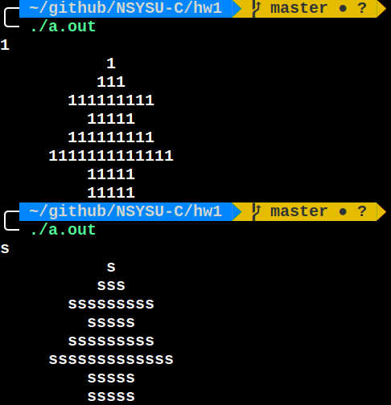
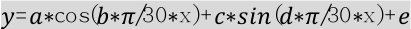
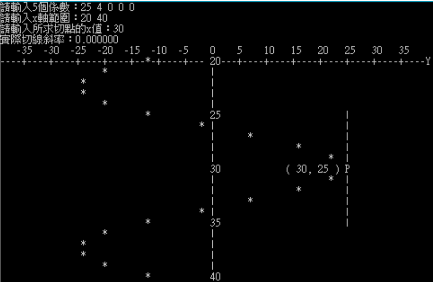
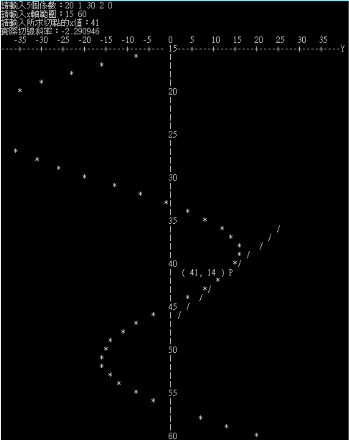
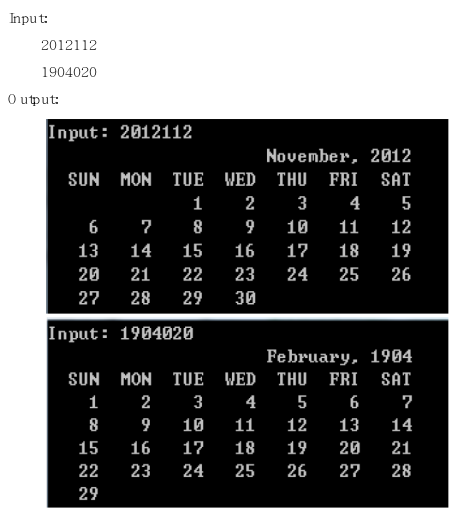
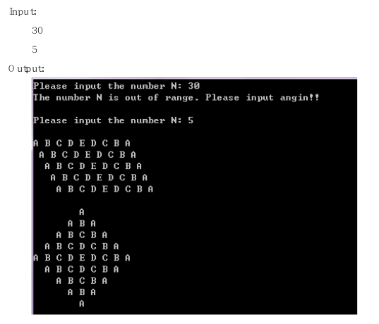
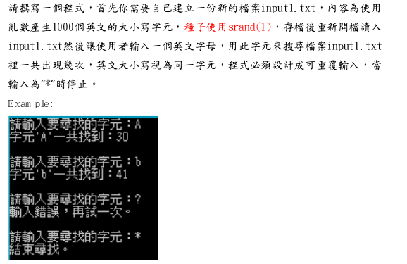

# NSYSU-C
NSYSU Assignment

## 1. print-character-tree
* `printf()`

 

## 2.Arithmetic
* `scanf()`
* `printf()`

## 3.compute-area

## 4.show-annual-salary
* formatted print & if

## 5.Temperature-Unit-Conversion
"Fahrenheit to Celsius" & "Celsius to Fahrenheit"

## 6.Triangle-Type
* if else
* for
* while
* do while

## 7.Draw-Equation
  
  

 

## 8.Show-Calendar

  

## 9.Draw-Diamond-Parallelogram

  

## 10.random-input

  

## 11.Differential-and-Integral

  

  

## 12.Find-First-Second-Largest

## 13.Check-Leap-or-Common-Year

## 14.99-Multiplication-Table

## 15.Check-Palindrome-Number

## 16.Armstrong-Number

## 17.Adder

## 18.